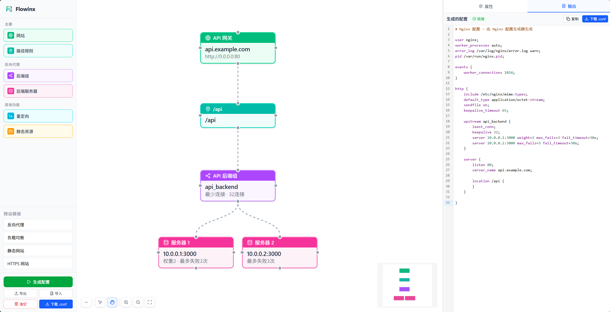

<div align="center">


# Flowinx

**拖拽式 Nginx 配置生成器**

拖拽节点，连接服务，像画架构图一样生成 `nginx.conf`。

<br />

<p>
  <a href="https://wiki.stxwer.top/flowinx/"><strong>🌐 在线使用</strong></a>
  &nbsp;·&nbsp;
  <a href="#简介"><strong>简介</strong></a>
  &nbsp;·&nbsp;
  <a href="#快速开始"><strong>快速开始</strong></a>
  &nbsp;·&nbsp;
  <a href="#开发计划"><strong>开发计划</strong></a>
</p>

<p>
  
  
  
  
</p>

<br />



</div>

---

## 简介

**不写代码，只画图。**

在画布上拖入网站、路径规则、后端服务，连上线——Flowinx 自动生成结构完整的 `nginx.conf`。支持反向代理、静态文件、禁止访问、HTTPS、负载均衡、IP 黑白名单。配置可保存为 JSON，随时导入继续编辑。

---

## 功能特性

| 能力 | 说明 |
| ---- | ---- |
| 站点配置 | 域名、端口、HTTPS、SSL |
| 路径规则 | 反向代理 / 静态文件 / 禁止访问 |
| 后端服务 | upstream 负载均衡 + 多后端服务器 |
| 访问控制 | IP 黑白名单 |
| 请求头 | X-Forwarded-For |
| 配置管理 | 预设模板、JSON 导入导出、一键下载 `.conf` |

---

## 节点类型

```text
网站
├─ 路径规则
│  ├─ 后端组
│  │  └─ 后端服务器
│  └─ 静态资源
└─ 重定向
```

| 节点 | 用途 |
| ---- | ---- |
| 网站 | 域名、端口、HTTPS |
| 路径规则 | location 路径匹配 |
| 后端组 | upstream 负载均衡组 |
| 后端服务器 | 具体后端地址 |
| 重定向 | 跳转规则 |
| 静态资源 | 本地静态文件目录 |

---

## 典型场景

**反向代理**
```text
网站 → 路径规则 → 后端组 → 后端服务器
```
把 `/api`、`/admin` 等路径转发到不同后端。

**静态文件**
```text
网站 → 路径规则 → 静态资源
```
前端站点、图片目录等静态文件服务。

**禁止访问**
```text
网站 → 路径规则 → 返回 403 / 404 / 401
```
屏蔽敏感路径或临时关闭访问。

---

## 快速开始

```bash
npm install
npm run dev       # → http://localhost:5173
npm run build     # → dist/
```

---

## 部署

纯静态站点，任意 Web 服务器即可：

```bash
npx serve dist
```

Nginx 部署示例：

```nginx
server {
    listen 80;
    server_name flowinx.example.com;
    root /var/www/flowinx/dist;
    index index.html;
    location / {
        try_files $uri $uri/ /index.html;
    }
}
```

---

## 技术栈

| 技术 | 用途 |
| ---- | ---- |
| React 19 | 前端框架 |
| TypeScript | 类型安全 |
| @xyflow/react | 节点画布 |
| Zustand | 状态管理 |
| Tailwind CSS | 样式 |
| CodeMirror | 代码展示 |

---

## 开发计划

- [x] 拖拽式可视化画布
- [x] 6 种 Nginx 节点类型
- [x] 反向代理 / 静态文件 / 禁止访问
- [x] HTTPS、SSL、XFF、IP 黑白名单
- [x] 负载均衡与 upstream 配置
- [x] 4 个预设模板
- [x] JSON 导入 / 导出
- [x] 语法高亮配置预览
- [ ] 深色模式
- [ ] AI 评估配置
- [ ] AI 优化配置
- [ ] 基于 nginx 配置生成架构图
- [ ] 配置 Diff 对比
- [ ] 更多 Nginx 节点类型
- [ ] 多语言支持（i18n）

---

## License

[MIT](LICENSE)
